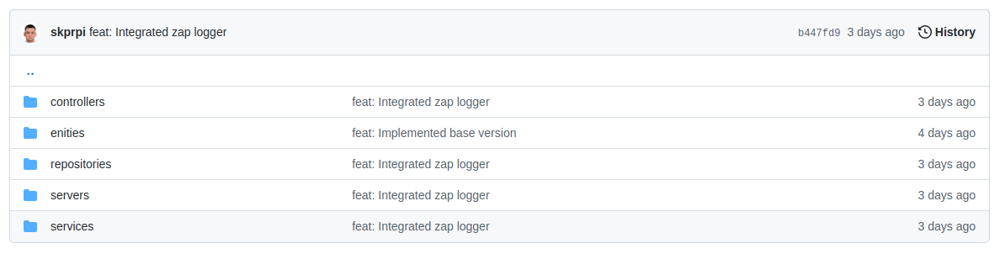

### Начальное состояние

```
type GRPCUserServer struct {
	proto.UnimplementedUserServer
	controller userController
	logger     *zap.Logger
}

func NewGRPCUserServer(controller userController, logger *zap.Logger) *GRPCUserServer {
	return &GRPCUserServer{
		controller: controller,
		logger:     logger,
	}
}

func (s *GRPCUserServer) CreateUser(ctx context.Context, request *proto.UserData) (*proto.UserId, error) {
	insertResult, err := r.collection.InsertOne(ctx, userDocument{
		Name:    request.GetName(),
		Surname: request.GetSurname(),
	})
	if err != nil {
		s.logger.Debug("Insertion failed with error", zap.String("error", err)
		return nil, err
	}
	insertedId :=  insertResult.InsertedID.(primitive.ObjectID).Hex()
	s.logger.Debug("Insert result", zap.String("id", insertedId))
	return return &proto.UserId{
		Id: insertedId,
	}, nil
}

func (s *GRPCUserServer) GetById(ctx context.Context, request *proto.UserId) (*proto.UserData, error) {
	var document userDocument
	objectId, err := primitive.ObjectIDFromHex(id)
	if err != nil {
		return nil, err
	}
	err = r.collection.FindOne(ctx, bson.D{
		{"_id", objectId},
	}).Decode(&document)
	if err == nil {
		return enities.NewUser(document.Name, document.Surname), nil
	}
	r.logger.Error("Database connection error", zap.String("error", err.Error()))
	return nil, err
}
```

### Исправленное состояние

```
https://github.com/skprpi/go_messenger/tree/dev/user_service/internal
```

### Описание

Ознакомившись с заданием hard work я понял, что оно достоточно хорошо сочетает с рефакторингом проводимым мною в проекте на `Go` (Недавно начал его изучать с целью переквалификации из С++ разработчика в Go). На момент написание одной из первых версий мой `user_service` выглядел примерно так, как было приведено в `Начальном состоянии`. И на момент написания мне казалось это приемлемым кодом. Однако до тех пор пока я не наткнулся на статью про `onion architecture` (после пары дней как я познакомился с этой архитектурой у Вас как раз вышла статья про нее). И тут пришло осознание что все плохо:

* 1 - нет четких границ разделяющих компоненты
* 2 как следствие 1 пункта нарушен SRP (допусттим нужно менять базу данных -> нужно менять все а не просто какой-то класс создать)
* 3 - ... оставлю этот пункт на подумать самому себе когда буду перечитывать

Ознакомившись с `onion architecture` я решил сразу сделать соответсвующую иерархию папок:



Пойду не по алфовитному порядку папок, а смысловому:

* `enities` - сущности. Это классы содержащие информацию об объектах с которыми предстоит работать. Их особенность в том, что они присутствуют в каждой из следующих компонент и если меняется логика работы с `бизнесс-данными` то придется менять вместе с ними все (что кажется логичным т к с изменением этой структуры предполагается изменение логики программы)
* `repositories` - тут мы храним все, что связано с базами данных. По сути это имплементация `CRUD` как я понял особенностью репозиториев от сервисов то, что `репозитории содержат 1 метод на 1 запрос к БД`
* `services` - тут уже находится `бизнесс-логика` т е тут мы можем вызывать несколько методов репозирия и программировать именно логику обработки и передачи полученных результатов. Так же важно, что сервис работает не напрямую с конкретным репозитарием, а его интерфесом - чтобы при замене базы данных достаточно было передать только новый инстанс класса. Приведу так же немного кода, чтобы разнообразить рассказ

```
type userRepository interface {                                          // <- сам интерфейс репозитория
	Create(ctx context.Context, request *enities.User) (string, error)
	GetById(ctx context.Context, id string) (*enities.User, error)
}

type UserService struct {                                                // <- имплементация сервиса
	repository userRepository
	logger     *zap.Logger
}

func NewUserService(repository userRepository, logger *zap.Logger) *UserService { // конструктор сервиса
	return &UserService{
		repository: repository,
		logger:     logger,
	}
}

func (s *UserService) Create(ctx context.Context, request *enities.User) (string, error) {
	return s.repository.Create(ctx, request)
}

func (s *UserService) GetById(ctx context.Context, id string) (*enities.User, error) { // *enities.User (работаем с сущностью а не протобафом)
	return s.repository.GetById(ctx, id)
}
```

* `controllers` - тут происходит валидация данных и перекладывание (в моем случае из протобафины в сущность) и потом обратно при получении ответа. Тут мы так же работаем с указателем на сервис (как и в прошлом случае) чтобы его легко можно было подменить

* `servers` - это по сути просто имплементация сгенерированного сервиса (честно говоря пока не разобрался зачем он нужен и кажется что можно имплементировать его сразу в контроллерах). Но я решил оставить это архитектурное решение опираясь на более опытного автора возможно в будующем я смогу ответить на этот вопрос

### Рефлексия

Это был на самом деле достаточно долгий рефакторинг - порядка недели и он достоточно хорошо подошел на мой взгляд для выполнения задания, но все же более явно следует выделить следующие не упомянутые мною вещи:

Как получилось описать границы и каков был способ их задания:
* описание границ производилось через систему типов (явно - через интерфес). из одного метода получилось выделить 4 сущности и каждая из них соответсвует SRP
    * repository - описывает только работу с базой данных (все ошибки базы данных остаются в методах сущности) на ружу попадают только общие ошибки для всех базах данных (они есть в файлк `repository/errors.go`)
    * service - отвечает за бизнесс-логику (например когда нужно вызвать несколько методов репозитория)
    * controller - отвечает за валидацию, финальную обработку ошибок и вызывает методы сервиса
    * server - предоставляет некий endpoint чтобы можно быстро было понять предоставляемое сервисом апи
* неявного задания границ нет (а зря - документацию хочу написать позже)

Как код влияет на остальные части системы?
* получившийся код явно разбил некий монолит на подсистемы-слои, которые соответсвуют SRP
