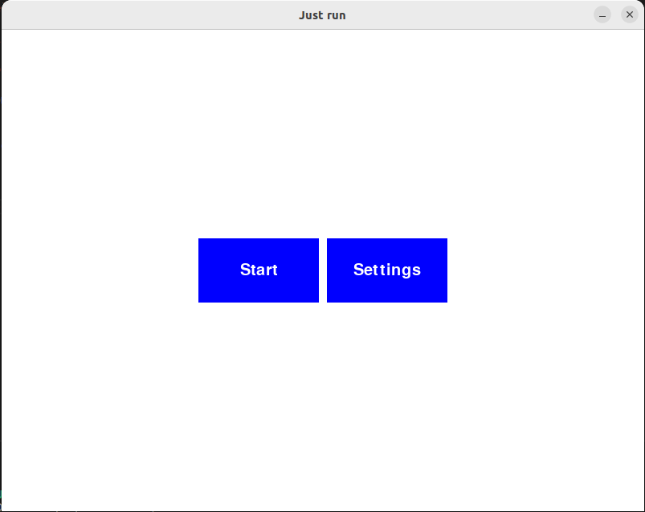
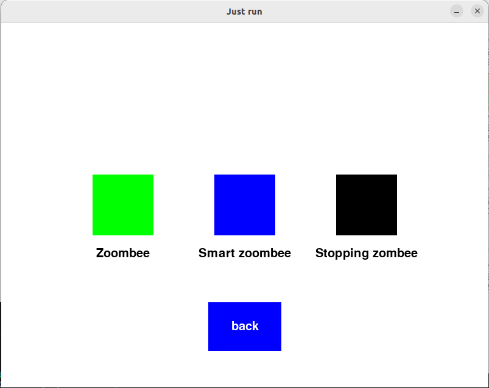
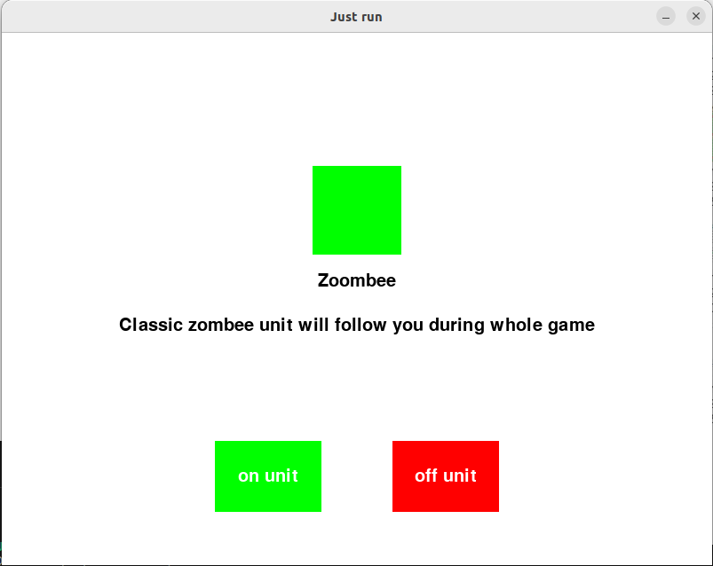
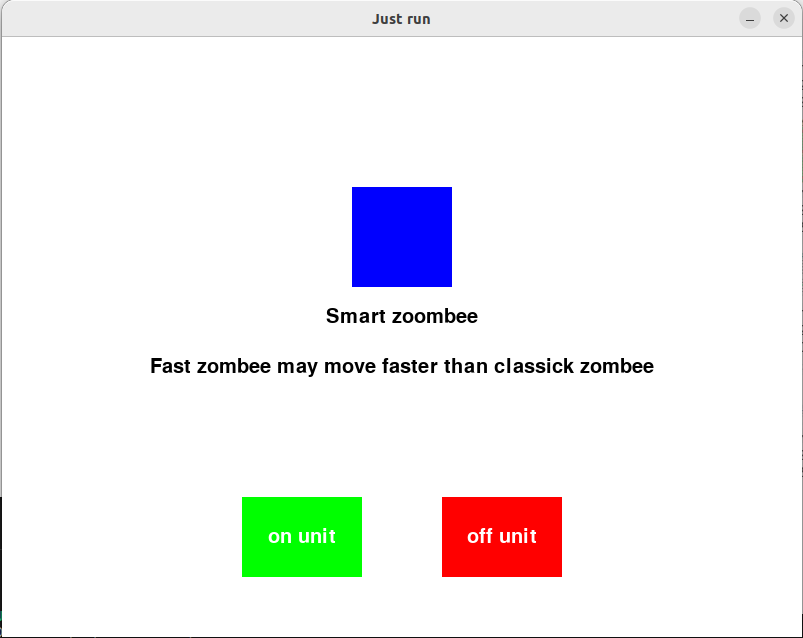
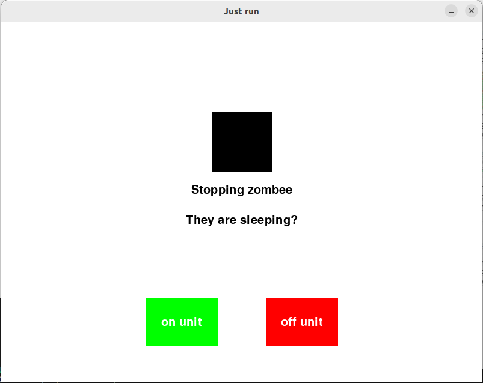
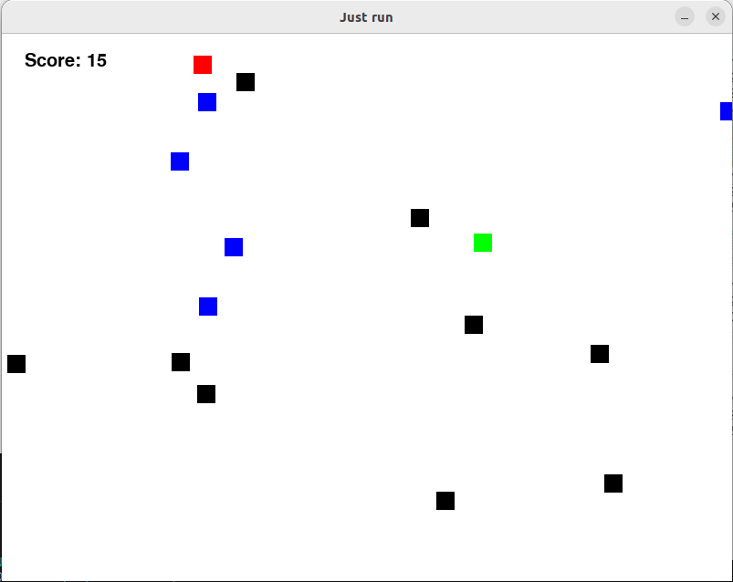
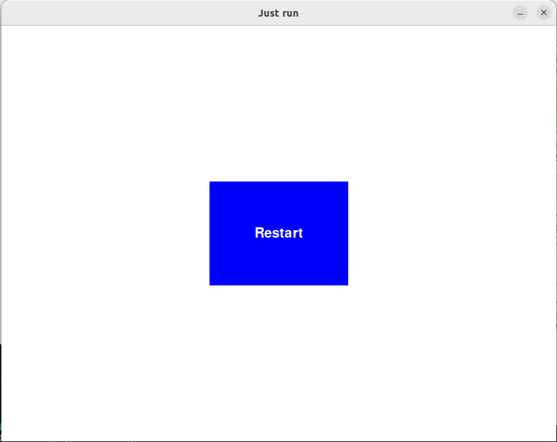

# ТЗ

Реализовать игру "Just run". Смысл игры - продержаться как можно дольше в клетке с зомби.
Реализовать типы зомби

* `zombee` - может быстро передвигаться но идет к месту где цель была некоторое время назад
* `smart zombee` - сразу определяет куда идти по положению игрока
* `sleeping zombee` - всегда стоит на месте

При прикосновении к любому типу зомби - проигрыш.

# Полььзовательские сценарии

* есть 3 типа замби и пользователь в настройках может выбрать какие из них буду присутствовать в игре - всего получаем 7 сценариев (без учета когда не берем ни один тип)

# Экраны

## Главный экран


## Экран настроек

Тут можно выбрать про какой тип зомби интересно получить информацию + по нажатию откроем нужный тип зомби и сможеи или добавить или исключить из игры


## Экран активации и деакцивации зомби





## Пример экрана игры - красный квадратик это наш персонаж



## Экран проигрыша



## Управление

стрелки вверх, вниз, влево, вправо (asdw - не работают)

## Сборка и запуск

```
./setup.sh
./run.sh
```

## Известные проблемы

* трясутся зеленые зомби
* можно выходить за границы экрана
* UI такое себе я нарисовал
* нет сохранения выбранных настроек
* не выводится финальный счет при поражении
* и много всего остального связанного с имплементацией

## Что на мой взгляд получилось хорошо

* В нескольких классах получилось сделать наследование от ограничений (пример с Lazy контроллером)
* Неплохая идея разделить в персонаже контроллер - отвечает за высчитывание следующий позиции исходя из текущей, view - то как отображается персонаж, поэтому можно составлять очень различные комбинации персонажей просто подменив классы

## Требует улучшения

* Работа с коллизиями - хотелось бы унести так же в класс Units, но не хватило времени + не сразу узнал что надо это все обрабатывать (т к нет опыта в создании игр)

## Совсем плохо

* UI классы которые я насоздовал кажутся самыми неудачными, возможно я плохо погуглил и есть хорошие средства из коробки или в доп плагинах
